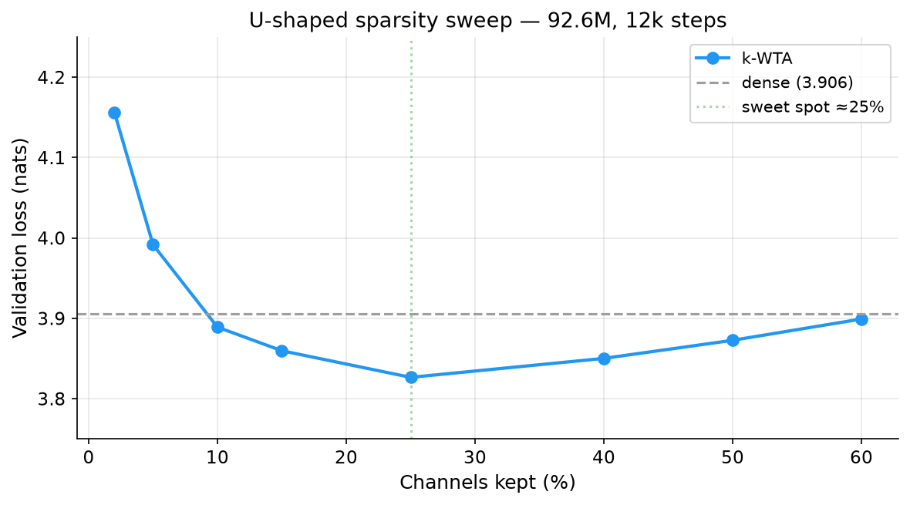
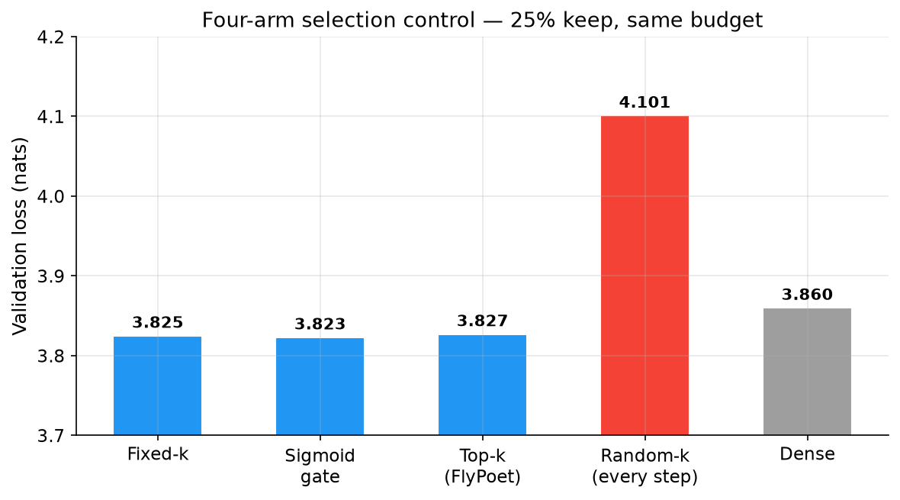
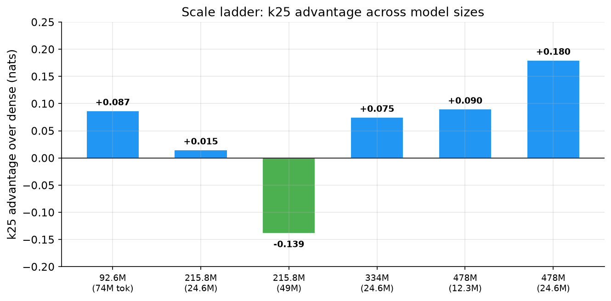

# flypoet

The fruit fly mushroom body solves a problem every large language model faces: **how to learn from limited experience without destroying what you already know.** It does this with four mechanisms — sparse competition, gated memory writes, parameter compartmentalization, and active forgetting — each individually well-studied in neuroscience, but almost never tested with matched controls in machine learning.

This repository does exactly that. We transplant each mechanism into a small language model, give it a fair shot, and then — critically — give every alternative explanation its own control. Some mechanisms survive. Some don't. The ones that survive are not the ones we expected.

---

## The setup

A 92.6M-parameter char-level GPT (RoPE / RMSNorm / SwiGLU / SDPA) trained from scratch on ~74M tokens of Chinese literary text. The fly mechanisms are inserted into the attention output of every transformer block:

- **k-WTA** — keep only the top 25% of channels by magnitude, zero the rest (channel-level competition, not token-level sparse attention)
- **Write gate** — during fine-tuning, update weights only when batch loss exceeds a running noise floor
- **Compartments** — each task gets a fixed random 30% of parameters to update
- **Forgetting shower** — data-free decay of low-magnitude weights

All experiments run at 5 scales (92.6M → 478M) with matched controls. Every number below is recomputable via `verify_claims.py`.

---

## What survives (with controls)

### 1. The sparsity benefit is U-shaped, and it's about *stability*, not competition

We swept 9 sparsity levels on identical 92.6M models:



Moderate sparsity (25%) beats dense. But the interesting question is *why*. We ran a four-arm control at matched 25% keep rate:



Fixed-k (a random but *stable* channel subset), sigmoid gate (learned soft gate), and top-k (competitive selection) all tie. The only failure is random-k — which redraws the subset every step. **The benefit comes from having a *stable* channel subset that downstream weights can adapt to, not from competition or input-dependent selection.** Any stable subset works; an unstable one is worse than dense.

This result was not what we expected. It also means the biological detail of *how* the fly picks its winners is irrelevant for this particular benefit — what matters is that the winners stay the same.

### 2. The sweet spot is regime-dependent, and the advantage grows with scale



k25 beats dense at four of six matched scale points. The 215.8M b16 point is the only inversion — and it is configuration-bound (disappears at batch 8). At 478M, doubling the training budget doubles the advantage (+0.090 → +0.180): **large models benefit more from sparsity when data-limited, and the advantage grows with training budget**.

This is not "25% is a magic number from biology." It is "the optimal sparsity depends on the interaction between model scale, data budget, and training schedule" — which is a more useful (and more honest) finding.

### 3. The code is an engine cylinder, not a library catalogue

The trained k-WTA code (top-25% channels) has a strange identity. It is:
- **Causally load-bearing**: zeroing it does 1.77× more damage than zeroing random channels
- **Input-specific**: zeroing another window's code does 20% less damage than zeroing your own (three-way shuffle control)
- **A topic address**: Hamming lookup retrieves same-domain neighbours at 2.6× chance, matching dense cosine
- **Stable and freezing**: cross-snapshot stability rises 0.45 → 0.89 monotonically
- **Compositional (provisionally)**: bigram codes overlap their char codes' union 1.67× more than random pairs
- **Not semantic**: code–PMI correlation is 0.03 (dense: 0.21); Hamming retrieval ties dense

So: the code carries computation and routes information, but it does not encode meaning. It is the engine cylinder, not the library catalogue.

### 4. Forgetting helps only if it forgets the right things — but the "repair" was noise

Our initial report claimed that data-free decay of low-magnitude weights repairs the overfitting tail (3.65 → 3.59). A fixed-validation-window re-verification showed the true effect is **zero** — the observation was sampling noise (the original random 24-batch protocol swings ±0.06 on an unchanged function). Uniform decay destroying the model (→ 6.60) is real, but that only says "scaling all weights by 0.6 is harmful."

The right-hand chart shows the CL dose-response: more batch updates = more forgetting + more learning, monotonically. The gate sits exactly on this curve — its benefit is throttling, not surprise selectivity.

### 5. The code is an engine cylinder, not a library catalogue

The trained k-WTA code (top-25% channels) has a strange identity. It is:
- **Causally load-bearing**: zeroing it does 1.77× more damage than zeroing random channels
- **Input-specific**: zeroing another window's code does 20% less damage than zeroing your own (three-way shuffle control)
- **A topic address**: Hamming lookup retrieves same-domain neighbours at 2.6× chance, matching dense cosine
- **Stable and freezing**: cross-snapshot stability rises 0.45 → 0.89 monotonically
- **Compositional (provisionally)**: bigram codes overlap their char codes' union 1.67× more than random pairs
- **Not semantic**: code–PMI correlation is 0.03 (dense: 0.21); Hamming retrieval ties dense

So: the code carries computation and routes information, but it does not encode meaning. It is the engine cylinder, not the library catalogue.

### 6. Negative results, reported in full

- **"Free calibration gain" at mid-training** — Dense catches up by 24k
- **Sparse representation prevents forgetting** — k-WTA trunk + plain FT forgets 0.674 (vs dense 0.692)
- **Surprise selectivity matters** — Random-skip control matches gate exactly (0.130 vs 0.143)
- **Trained projection > hash encoder** — D1: 0.142 vs 0.144 (parity)
- **Targeted forgetting repairs overfit** — Fixed-window: zero effect across 4 bases
- **25% is a universal constant** — 216M-b16 inversion (config-bound)
- **k-WTA probe works on frozen features** — Loses to linear probe (0.570 vs 0.642)

The pattern: **the fly's mechanisms that survive are management policies (write less, use stable subsets, partition parameters), not representation improvements.**

---

## The full picture

All results, negative and positive:

| Scale | Protocol | Dense | k25 | Δ |
|---|---|---|---|---|
| 92.6M | b24, 74M tok | 3.906 | 3.819±0.016 | +0.087 |
| 215.8M | b8, 24.6M tok | 4.870 | 4.855 | +0.015 |
| 215.8M | b16, 49M tok | 4.181 | 4.320 | **−0.139** |
| 334M | b8, 24.6M tok | 5.266 | 5.191 | +0.075 |
| 477.8M | b4, 12.3M tok | 5.626 | 5.536 | +0.090 |
| 477.8M | b4, 24.6M tok | 5.486 | 5.306 | **+0.180** |

Additional analyses:
- **Distributional divergence**: k25 generates from a self-consistent distribution (self-NLL 2.39 vs dense 2.42, distinct-3 0.847) that is foreign to dense (cross-NLL 2.64) — not a degraded dense, a different computation
- **Developmental freezing**: the address system freezes during training (0.45→0.89) while semantics never enter (PMI stays 0.03)
- **Elite structure**: channel win-rates are concentrated (Gini 0.50–0.58) but elite identity is seed-specific
- **Elastic inference**: k25-trained models tolerate reducing k gracefully but collapse when increasing it

---

## Reports and data

- [PAPER.md](PAPER.md) — consolidated working paper (English)
- [REPORT_V2.md](REPORT_V2.md) — three-arm study, sweep, scale ladder
- [REPORT_MEM.md](REPORT_MEM.md) — memory trilogy, follow-ups, retractions
- [LITERATURE_SYNTHESIS.md](LITERATURE_SYNTHESIS.md) — competitor map and positioning
- [NOTES_RLCD.md](NOTES_RLCD.md) — pre-registration, methodology log, internal codenames
- [literature_notes.md](literature_notes.md) — literature night notes (10 blocks, 7 deep reads)
- `logs_v2/ALL_RUNS.md` — unified table of all runs
- `logs_v2/credentials_report.json` — 16/16 claims verified

## Reproducing

```bash
python train_v2.py --arm std --steps 24000
python train_v2.py --arm flynetS --kfrac 0.25 --tag _k25 --steps 12000
python cl_experiment.py fly 1500 std          # gated continual learning
python cl_experiment.py skip 1500 std         # random-skip control
python shower_verify.py                       # fixed-window shower audit
python verify_claims.py                       # recompute all headline numbers
python code_address.py && python domain_retrieval.py
```

`train_v2.py` and `cl_experiment.py` resolve paths relative to the repo root; `data_v2/` must exist. Model weights (350MB each) are not committed. GPU jobs are strictly serial — 334M CL at batch ≥ 16 triggers CUDA sysmem fallback.
